# Docker Introduction
Basic Exercises to get up to speed with Docker CE

**Pre-req to have Docker installed locally**

This guide is intended to assist you with basic understanding of containers, how they are built and how they run.  Open a terminal on your computer to follow the guide.  We will first pull down a public Nginx web server image and run it locally.  Then see how we go about building our own image based off of it, and running it.

##  Step 1 - What is an Image?

Step 1.1 

A Docker image is a file, comprised of multiple layers, used to execute code in a Docker container.  For our demo purposes, we will be using the Nginx image, which is a web server/reverse proxy.

`docker pull nginx` </br>

<details><summary>Screenshot 1.1 </summary>
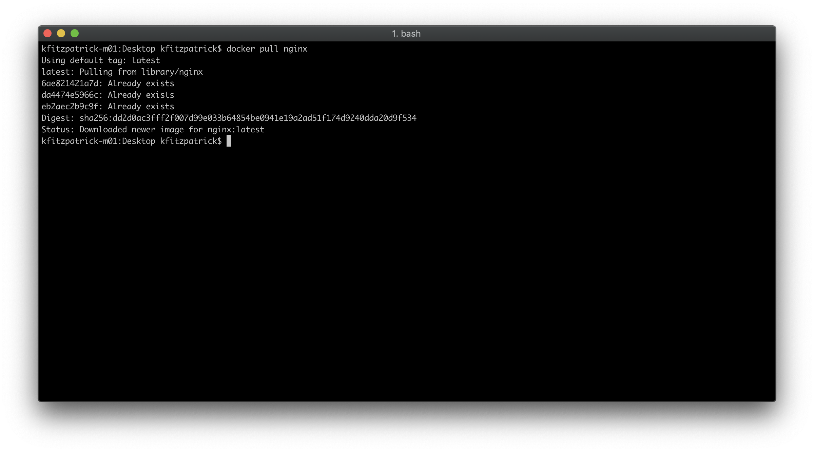
</details>
<br/>

Docker will check to see if you have `nginx` image stored locally, and if not, goes out to the default public registry to pull down the latest version of the `nginx` image.  You can see it being pulled down layer by layer and stored locally on your docker host. 

Step 1.2 

`docker images` </br>

<details><summary>Screenshot 1.2 </summary>
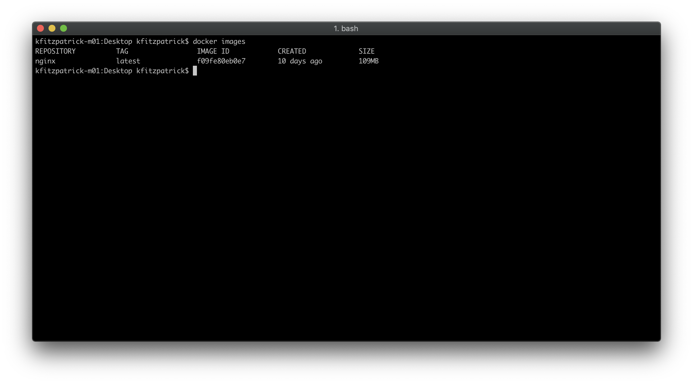
</details>
<br/>

After running this command, you will now see the image listed with it's name, version, unique Image ID, when it was created and size of the image.

## Step 2 - What is a Container?

A container is a runnable image.  Images can be used to create many containers based off of its image.

Step 2.1 

`docker run -d -p 8080:80 nginx` - this command will run the image you just pulled to your local docker host in *detached mode* (so you can keep using your terminal) and map the default `nginx` container port 80 to your localhost:8080 port. 

<details><summary>Screenshot 2.1 </summary>
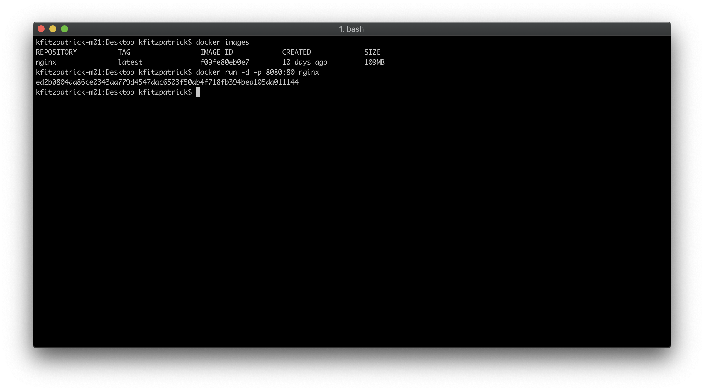
</details>
<br/>

Step 2.2

`docker ps` - this command will show you the running container with it's unique ID, image name, commands run within it to start, time created, status, port mapping, and a unique randomized name generated by Docker.

<details><summary>Screenshot 2.2.1 </summary>
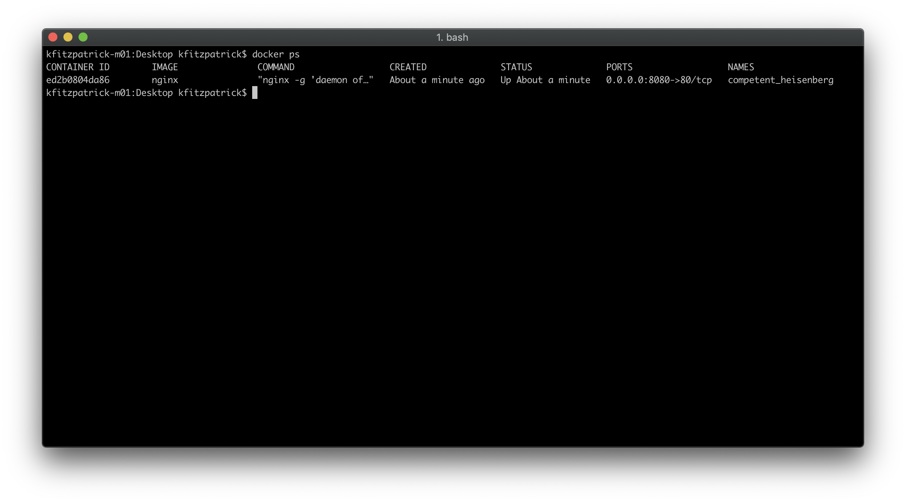
</details>
<br/>

Open a browser and navigate to `localhost:8080`, where we mapped our nginx container to.  You should see the default splash page for `nginx`.

<details><summary>Screenshot 2.2.2 </summary>
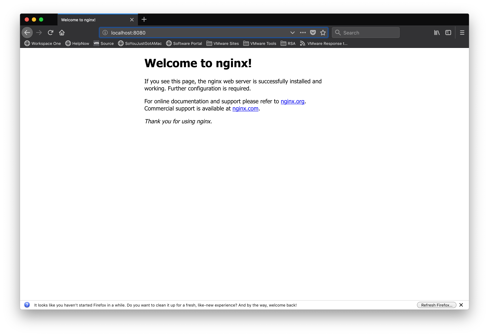
</details>
<br/>

Step 2.3 

`docker stop <container id>` - input the container ID you see from the `docker ps` command you ran previously.  This will only stop the container, not delete it.

<details><summary>Screenshot 2.3 </summary>
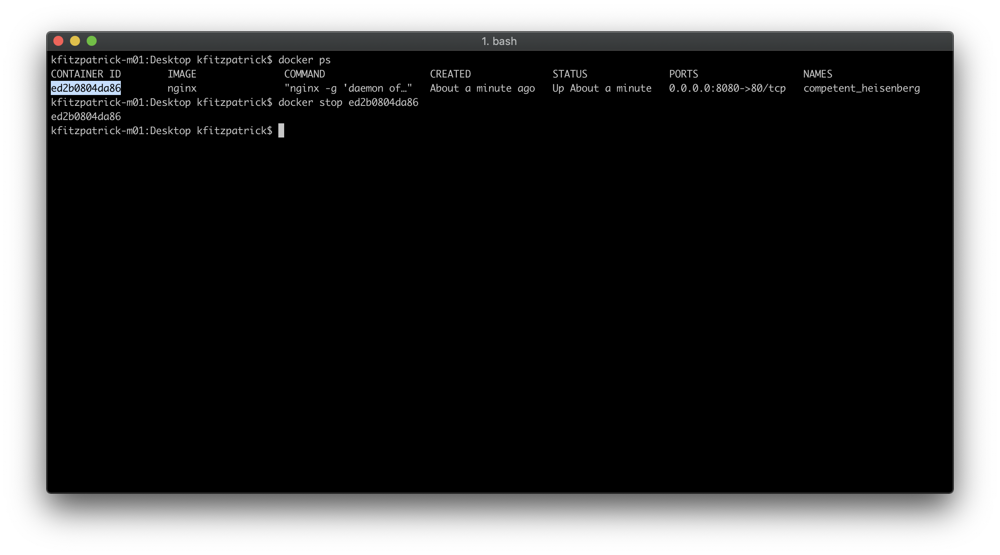
</details>
<br/>

Step 2.4 

`docker ps -a` - this shows you that the container now has an `Exited` status and the port mapping is no longer listed

<details><summary>Screenshot 2.4 </summary>
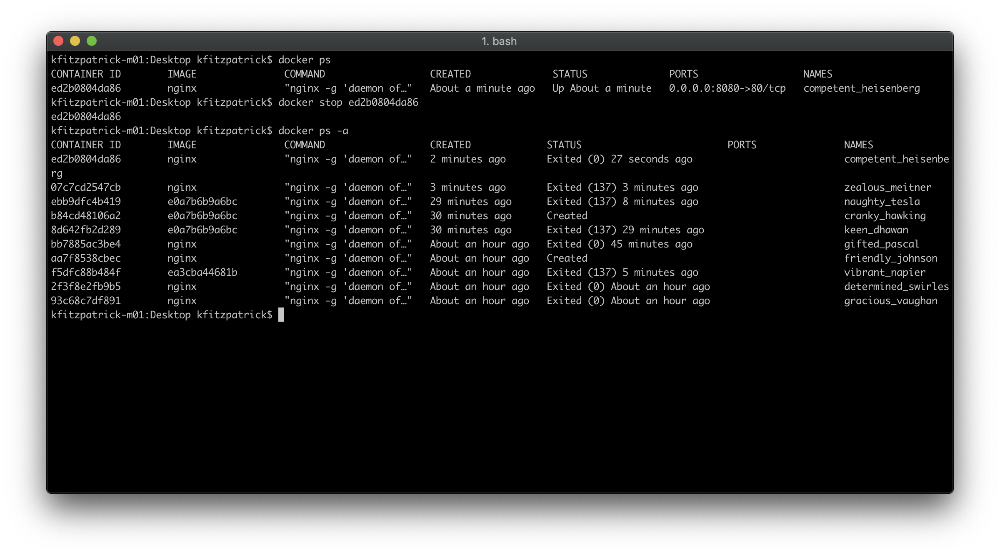
</details>
<br/>

## Step 3 - How do you build an image?

The key component in building an image is the Dockerfile.  This is how you will set the parameters, commands to run, and input source code into the image you wish to create.  We will build a very simple customized nginx image to show how this works.  The instructions below will work if you are running on a Mac, if running Windows you may need to make adjustments.

Step 3.1 Create a folder on your desktop named welcome_app, and change directory inside of it.

Run `cd ~/Desktop`<br/>
Run `mkdir welcome_app`</br>
Run `cd welcome_app`</br>

<details><summary>Screenshot 3.1 </summary>
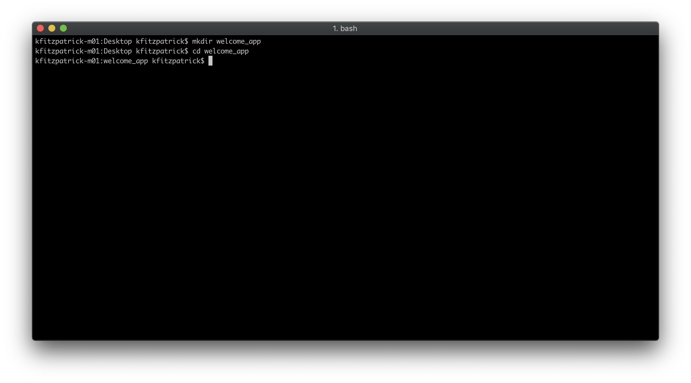
</details>
<br/>

Inside of this folder, we will create the Dockerfile and our custom index.html source code which will create the splash page we want when running this image.  Feel free to use any text editor or `nano Dockerfile`</br>

Step 3.2 Copy and paste the below into your Dockerfile and save.

```
FROM nginx:alpine

COPY index.html /usr/share/nginx/html
```

<details><summary>Screenshot 3.2 </summary>
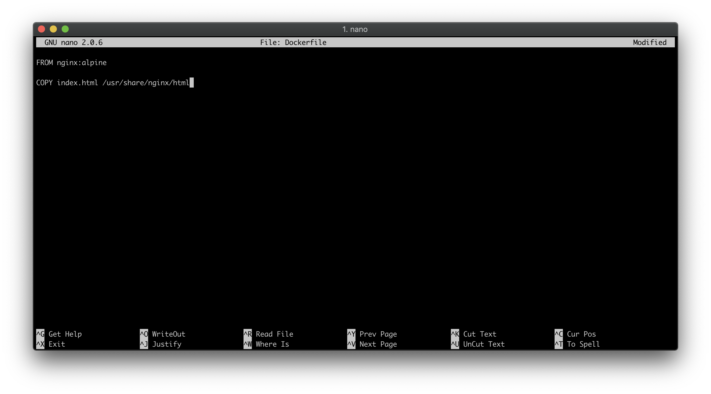
</details>
<br/>

This tells Docker, when we build this image we want it to be based on the `nginx:alpine` base image, and to copy in our index.html file into the html directory of `nginx:alpine`.

Step 3.3 In the same folder, create an index.html file.  You can make this any HTML you would like, below is what I use for the example.

```
<!DOCTYPE html>
<html>
  <head>
    <meta charset="utf-8">
    <title>Hello!</title>
  </head>
  <body>
    <h1>You just built this docker image!</h1>
    <p>Think of how much easier this would be to package dependencies, and iterate through improving your app!</p>
  </body>
</html>
```

Save this file.

<details><summary>Screenshot 3.2 </summary>
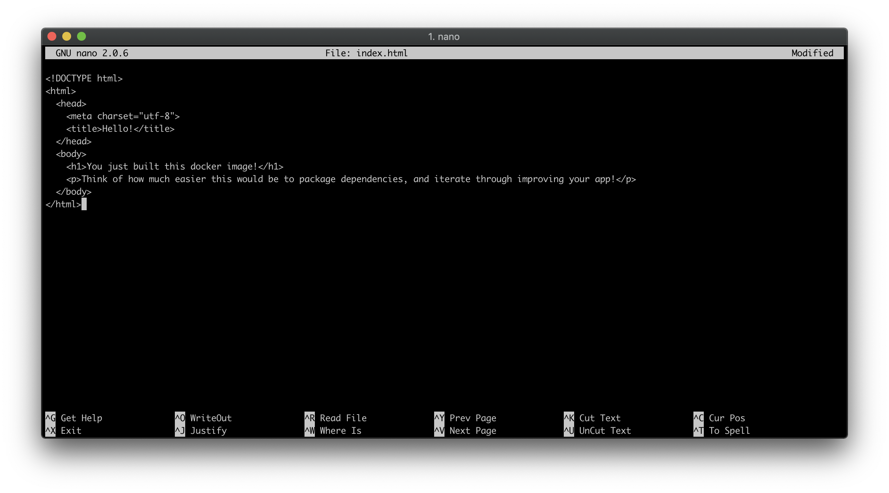
</details>
<br/>

Now we have the Dockerfile, and our custom index.html that will be copied into our image.

Step 3.4 `docker build -t welcome_app .` - this command is building the image based off of the Docker file, giving it the name (-t is tag) *welcome_app* and building off of the local directory `.`

Great!  We have just built our image, now lets run it the same way we did before.

Step 3.5 

`docker run -d -p 8080:80 welcome_app`

Navigate in a browser to localhost:8080 and you should see the `nginx` serving up our custom HTML!

<details><summary>Screenshot 3.5 </summary>
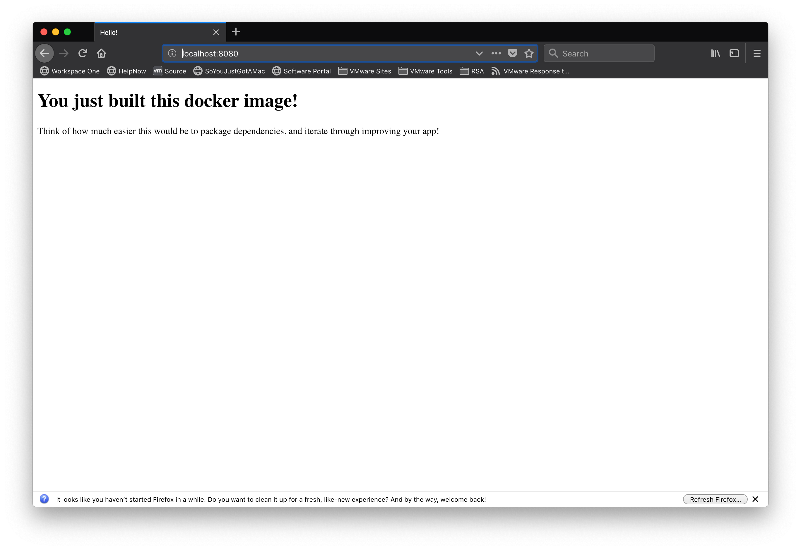
</details>
<br/>

Step 3.6 

`docker stop <container id>` - this command will stop our application.


